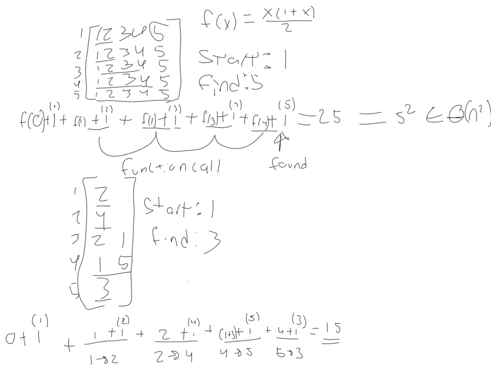

# Search in Graphs

Recall the pseudocode for Depth-First Search:

Given a graph, a start node, and a node we're looking for:
- starting at the start node, while unvisited nodes remain
    - if current vertex $v$ is the node we're looking for, return it
    - mark $v$ as visited
    - for each edge $(v,w)$
        - recursively process $w$ unless marked visited

Implement the algorithm. You can choose any of the data structures we covered
(adjacency matrix or adjacency list) for the implementation. Your function
should return the list of nodes on the path from the start to the target (not
the list of nodes that you looked at during the search). If start and target are
the same, it should return a list with only that node. If there is no path from
the start to the target, it should return an empty list. Start with the template
I provided in `code.js` and test your new function.

I have not provided any test code, but you can base yours on test code from
other exercises. Your tests must check the correctness of the result of running
the function and run automatically when you commit through a GitHub action.

## Runtime Analysis

What is the worst-case big $\Theta$ complexity of your implementation? Add your
answer, including your reasoning, to this markdown file.

## My answer:
My code only has one loop in it and this loop iterates though each connection to the starting node. worst case the node could be connected to every other node including itself so this loop runs n times. 
Inside the loop i have a checked array that stores all the nodes i have checked already, this line has a complexity of n because in the worste case it might have to check every item in the list to see if the list includes the item or not.
Then in the loop i also have it calling the search function again. the maximum number of times this function can be called is n times as if the graph looks like alinked list we would have to traverse every node to get to the desired one at the end.
so our recurrence relation looks like f(n) = n * (n + f(n-1)) $\in \theta(n^2)$

As you can see in the work that i did in the worst case it would end up being O(n^2) but otherwise less than that.

## Bonus

Implement and analyze breadth-first search.

I certify that I have listed all sources used to complete this exercise, including the use of any Large Language Models. All of the work is my own, except where stated otherwise. I am aware that plagiarism carries severe penalties and that if plagiarism is suspected, charges may be filed against me without prior notice.